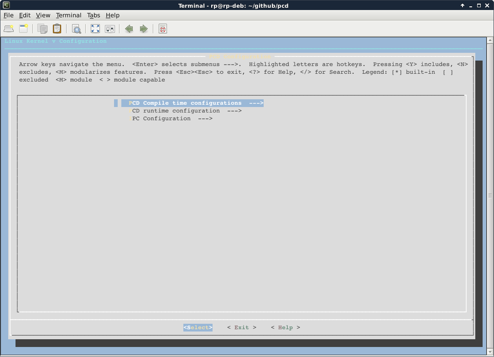

[introduction](index.md) | **~~build pcd~~** | [pcd cli](cli.md) | [pcd scripts](script.md) | [exception handlers](except.md) | [dependency graph](depend.md) | [generate header file](header.md) | [api](api.md)

CONFIGURE AND BUILD THE PCD
===========================
The current PCD package contains a configuration system that is similar to the Kernel configuration system. Unlike the older versions of PCD, the configuration process is now more user friendly and easy. Please follow the following steps in order to configure and build the PCD project for your target platform:

## FIRST STEP: Download PCD sources
There are few different ways to get the PCD sources to your build machine.

### Clone the Repo
Use the following command to clone the PCD repo to the requested destination:
```shell
$> git clone git@github.com:meetrp/pcd.git
Cloning into 'pcd'...
remote: Counting objects: 595, done.
remote: Compressing objects: 100% (260/260), done.
remote: Total 595 (delta 335), reused 575 (delta 324), pack-reused 0
Receiving objects: 100% (595/595), 1.33 MiB | 357.00 KiB/s, done.
Resolving deltas: 100% (335/335), done.
Checking connectivity... done.
```

### Download & Extract PCD package
Use the following set of commands to download the package and extract the PCD package to the requested destination.

#### Download the ZIP package
Here I shall show how to use the `wget` command to download the latest source code from GitHub.
```shell
$> wget https://github.com/meetrp/pcd/archive/master.zip
--2017-10-15 19:32:46--  https://github.com/meetrp/pcd/archive/master.zip
Resolving github.com (github.com)... 192.30.253.112, 192.30.253.113
Connecting to github.com (github.com)|192.30.253.112|:443... connected.
HTTP request sent, awaiting response... 302 Found
Location: https://codeload.github.com/meetrp/pcd/zip/master [following]
--2017-10-15 19:32:47--  https://codeload.github.com/meetrp/pcd/zip/master
Resolving codeload.github.com (codeload.github.com)... 192.30.253.121, 192.30.253.120
Connecting to codeload.github.com (codeload.github.com)|192.30.253.121|:443... connected.
HTTP request sent, awaiting response... 200 OK
Length: unspecified [application/zip]
Saving to: ‘master.zip’

master.zip      [           <=>                                     ] 303.81K   109KB/s   in 2.8s

2017-10-15 19:32:52 (109 KB/s) - ‘master.zip’ saved [311100]
```

#### Extract the ZIP package
```shell
$> unzip ./master.zip 
Archive:  ./master.zip
07043e2225cb287ac449d993538ec36699c9e8c8
   creating: pcd-master/
  inflating: pcd-master/.gitignore   
  inflating: pcd-master/LICENSE      
  inflating: pcd-master/Makefile     
   creating: pcd-master/docs/
  inflating: pcd-master/docs/_config.yml  
  ....
  ....
  ....
  ....
  inflating: pcd-master/scripts/kconfig/zconf.l  
  inflating: pcd-master/scripts/kconfig/zconf.y  
```

## SECOND STEP: Configure the PCD
Starting from release 1.0.5, the PCD is configured via the Kconfig configuration engine, similarly to the Linux Kernel configuration method.
The supported configuration commands are:
- **make defconfig** – Configure default PCD settings.
- **make menuconfig** – Configure the PCD settings in a textual menu. This option is the preferred option if you are building on a build server and connect to it via Tenlet/SSH.
- **make xconfig** – Configure the PCD settings in a graphical menu. This option is the preferred option if you are building on a PC Linux machine, and requires the qt3-devel library to be installed first (look it up here).
- **make oldconfig** – Configure the PCD using existing settings in .config file. Use this option to apply your platform’s configuration file (place it in the root directory as .config, and run the command).

The menu interfaces provide help per each configuration option. Don’t forget to:
- Select the correct platform (or other if it is not supported).
- Setup your cross compiler.
- Setup your target installation directory.

<p align="center">

<u><b>make menuconfig</b></u>
</p>

#### Older version of PCD
If you are using an older version of PCD which does not support the Kconfig option, you are encouraged to upgrade. Otherwise, follow these steps:
The build script allows the user to configure some of the build environment variables. Here is the list of the variables that can be configured, and an example:
- **CC**: Define the Target’s Cross compiler. The following example configures a cross compiler for ARM-Linux-uClibc target. If CC is not defined, the native host compiler is used.
```shell
$> export CC=armeb-linux-uclibceabi-gcc
````
- **INCLUDE_DIR_PREFIX**: Define your project’s include directory, in case there are extra header files required (such as ANSI-C headers, etc.). If the variable is not defined, then the compilation process will use the default headers as specified by the compiler.
```shell
$> export INCLUDE_DIR_PREFIX=<your_project_path>/include
```
- **INSTALL_DIR_PREFIX**: Defines the target installation prefix, or in other words, where to install the binaries. Usually, when creating a file system image for a target, it is temporary stored somewhere in the host machine. Use this variable to specify this location.
```shell
$> export INSTALL_DIR_PREFIX=<your_project_path>/filesystem
```
- **USE_STATIC_LIBS**: Configures the PCD to compile and link with static libraries only, instead of shared libraries (by default). This option can be used in systems without shared libraries support. Note that this flag will increase the final size of the PCD executable.
```shell
$> export USE_STATIC_LIBS=y
```
- **LIB_DIR_PREFIX**: Specifies additional directory for the linker to look for libraries. Use this flag in case your tool chain does not know where your C library is installed (usually this is not required).
```shell
$> export LIB_DIR_PREFIX=<your_project_path>/lib
```
- **Target configuration**: Currently, the PCD project supports three targets for the detailed crash dump; ARM, x86 and MIPS. The rest of targets will show a crash dump without detailed register dump. Enable CONFIG_ARM, CONFIG_X86 or CONFIG_MIPS accordingly in case you are compiling for one of these targets. Otherwise, do not enable any of these options.
```shell
$> export CONFIG_ARM=y
```

##### Notes
- Make sure that you have write permissions to the target directories you have selected.
- If the configuration stage fails, make sure you have **bison** and **flex** packages installed.

## THIRD STEP: Build and install the PCD
Starting from PCD release 1.0.5, there is a Top-Level Makefile that does everything for you. Run “**make all**” or “**make pcd**” to compile everything. Run “**make install**” to install the executables and libraries in the target filesystem, according to the configuration. The binaries are also installed to bin/host and bin/target directories for your reference.
```shell
$> make all install
```

For older versions, this stage is automated by the build script. Run it to build and install the PCD in your target’s file system image.
```shell
$> ./build-all.sh
```

## That’s all!
The PCD and its libraries are built and installed. If you are using an embedded platform, then the binaries are already installed in your target’s file system image and ready for use. You will need to regenerate the file system and reload it to your target. The PCD should be activated once the kernel has finished its loading.

**Note**: *Please note that without PCD scripts that contain rules, the PCD doesn’t do much. It must be configured for your system with the appropriate rules.*

## Cleaning the project
Starting from PCD release 1.0.5, run “**make clean**” to clean all the executables, libraries and objects. Run “**make distclean**” to clean also the configuration files.

For older releases, use the clean_all.sh script to clean everything.

