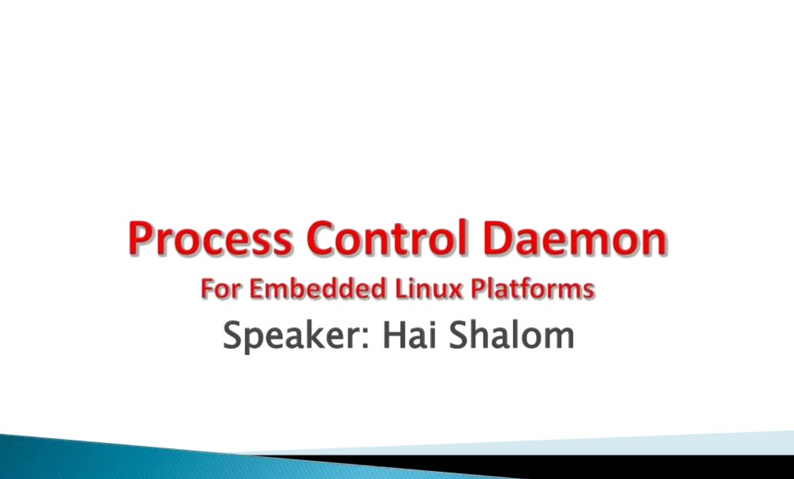
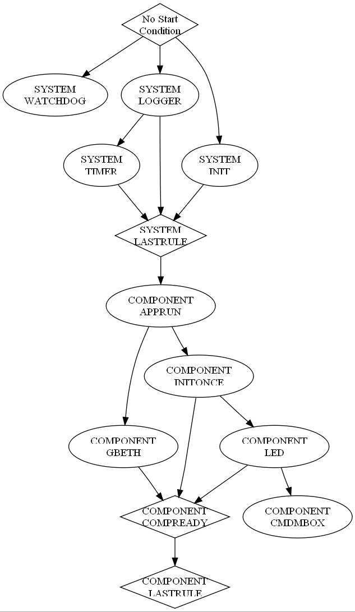

**~~introduction~~** | [build pcd](build.md) | [pcd cli](doc_index.md) | [pcd scripts](doc_index.md) | [exception handlers](doc_index.md) | [dependency graph](doc_index.md) | [generate header file](doc_index.md) | [api](doc_index.md)

INTRODUCTION
=============

## What is PCD?
PCD (**Process Control Daemon**), is an open source, light-weight, system level process manager for Embedded Linux based products (Consumer electronics, network devices, and more). With PCD in control, it is guaranteed that the system’s boot up time will be reduced, and its reliability, availability and robustness will be enhanced.

## Why do you need PCD in your Embedded Linux based product?
With PCD driving your product, you will gain:
- Enhanced control and monitoring on all the processes in the system.
- Simple, yet powerfull means to configure each process and service in the system:
	- When to start each process, configure its dependencies.
	- What resource or condition to check, per each process, in order to verify its successful startup.
	- What recovery action to take when a process fails to start or crashes during its work.
- Reduced system startup time
	- Rules are started as soon as their start condition is satisfied.
	- No need for non-deterministic delays. Dependencies are well defined and enforced.
	- Rules without inter-dependency are started in parallel.
- Enhanced debug capabilities of faulty processes
	- Exception handlers and logs provide useful and detailed information about process crashes, such as the process name and id, exception description, date and time, fault address, register dump, map file and more.
	- Crash log storage in non-volatile memory for post-mortem/offline analysis.
- Improvement in system stability and robustness.
- Generation of a graphic representation of the system startup sequence for further analysis.

## Some Background
The PCD project was started due to a need for a process controller which was missing in one of TI’s broadband solutions. In the early stages of the software development, the system was started using scripts, where the init.d/rcS script was doing some of the work, and it was calling other scripts which loaded all the processes, drivers and services. Needless to say, this method was far from fulfilling the required task, especially for a mass-production product. There were cases where we were not able to determine when a driver was initialized, so we added sleeps. In other cases, some process has crashed and we didn’t even notice it, but experienced unexpected system behavior. The debugging capabilities were also minimal. It is not trivial to work with gdbserver on an embedded target, it requires a stable communication channel and symbols.

Eventually, the PCD project has been initiated to provide an adequate solution to all these issues, and it has improved the product’s quality, robustness and stability. We were able to catch and fix all the crashes early using the extended debug information. Furthermore, it has reduced the boot up time significantly because the sleeps were not required anymore, and due to activation of many non-depended processes in parallel.

The PCD was originally designed and developed by [Hai Shalom](https://il.linkedin.com/in/haishalom) as a proprietary solution for Texas Instruments. During the last stages of the development, the PCD project was released by TI as an open source software and the project’s community is in process of growing. New programmers which find the PCD useful and interesting project are starting to contribute to the project with their ideas and innovations.

## Supported Architectures
The PCD is a user space application, therefore its exposure to the actual architecture is limited. However, supported platforms have an enhanced and detailed crash dump which displays all registers, thus allowing an easier debug.

The PCD fully supports the following architectures:
- ARM
- MIPS
- x86
- x64

Non-supported architectures should also work, but without the enhanced exception details.
If PCD does not support your platform, it is possible to support it if you’ll send the hardware and BSP.

## Already have a process controller in your product?
You can still use the PCD in “crash-daemon only” mode. In this mode, the PCD will not start your system nor monitor its processes. Instead, it will remain idle until one of your application crashes, and when that happens, the PCD will generate and log the detailed crash dump which could help you isolate and fix the bug. There is no need for any rules file, and in case you’ll like using PCD, you might consider upgrading your existing process controller.

## PCD High Level Presentation (updated)
The following slides provide a high level overview on the PCD project.

## Integrate PCD in 4 steps
Thinking about the integration effort? It’s not that difficult. Follow these 4 steps in order to integrate PCD in your Linux based system:

### Step 1: Get introduced
1. Download the latest PCD source code from the [GitHub](https://github.com/meetrp/pcd).
1. Download the PCD [documentation](trainings/pcd_hld.pdf)(original) and [training presentation](trainings/pcd_presentation_oss.pdf)(original).
1. Download, compile and install the PCD in your target’s file system.

### Step 2: Write rules
1. Determine the order and dependencies of each process, daemon or service.
1. Determine what is the condition for a successful init of each process.
1. Determine the recovery actions to take if they fail.
1. Write a rule per each process using the PCD’s simple syntax.
1. Run pcdparser to check your rules file for syntax errors.
1. Generate a dependency graph which describes your system’s startup.
1. Install the rules file(s) in the target’s file system.

  

### Step 3: Enhance your processes
1. Install the PCD’s exception handlers in your processes (you’ll gain a detailed crash log).
1. Replace any fork-exec or system( ) calls with the PCD API with the corresponding rule.
1. Send a “process ready event” to the PCD when your process has completed its initialization.

### Step 4: Activate PCD
1. Remove any script based startup. Remove explicit calls to daemons and processes.
1. Remove any delays and sleeps which were used for process synchronization.
1. Add one call to PCD along with your new rule file(s).

### That’s it!
Your system will now be booted with the PCD synchronizing and monitoring everything. In case of an error, it will provide a detailed crash log and take the necessary steps in order to recover the system.

## PCD Licensing
- The PCD project is licensed under the GNU Lesser General Public License version 2.1 (**LGPLv2.1**), as published by the Free Software Foundation.
- To view a copy of this license, visit [http://www.gnu.org/licenses/lgpl-2.1.html#SEC1](http://www.gnu.org/licenses/lgpl-2.1.html#SEC1)
- There are no purchase costs or royalty fees.
- This license allows commercial use without the need to expose proprietary source code. Any enhancements or features that are added to the PCD must be submitted back to the community.

## PCD Resources
Browse the PCD website, join the community, request features, report bugs, discuss in the forum and get help:
- (**ORIGINAL**) PCD project page at SourceForge: [http://sourceforge.net/projects/pcd/](http://sourceforge.net/projects/pcd/)
- (**ORIGINAL**) PCD presentations: [http://www.slideshare.net/haish](http://www.slideshare.net/haish)
- [PCD Design document](trainings/pcd_hld.pdf)
- PCD Documentation
- Examples for PCD debug capabilities: Resolving segmentation faults with PCD, Resolving alignment traps with PCD.

